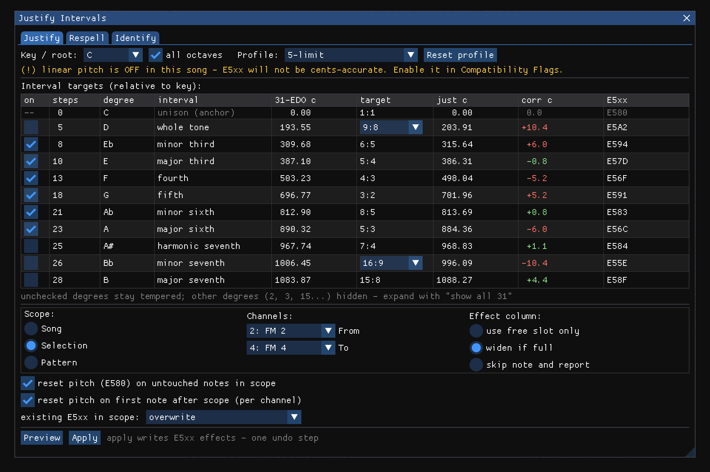
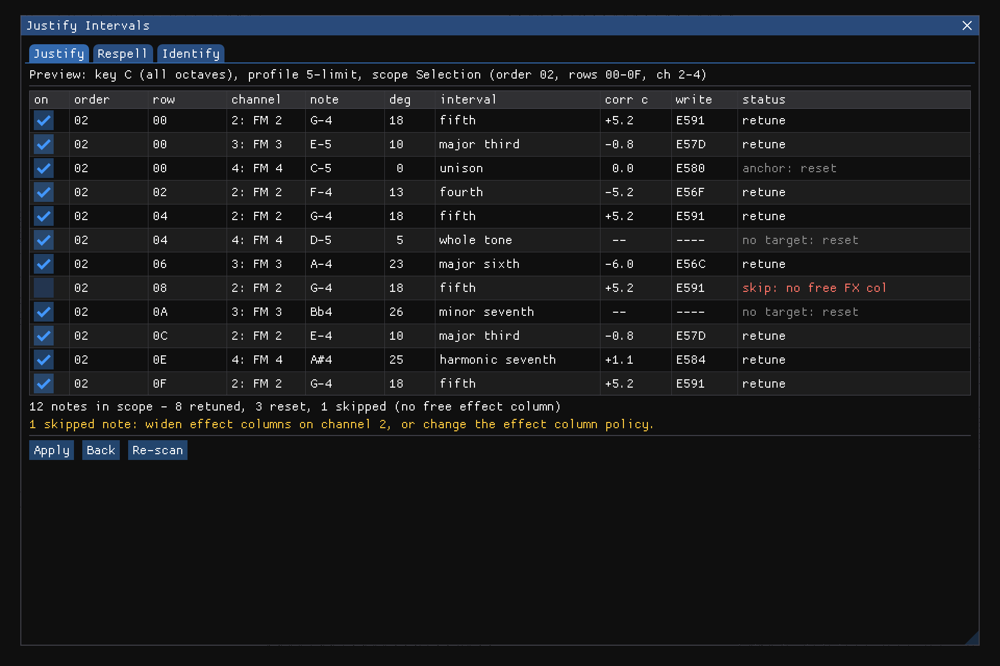
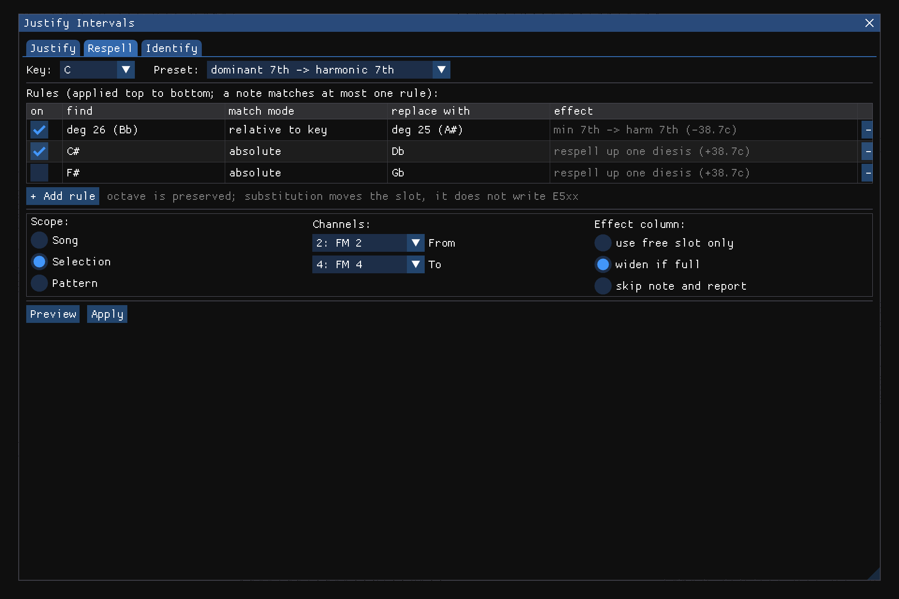
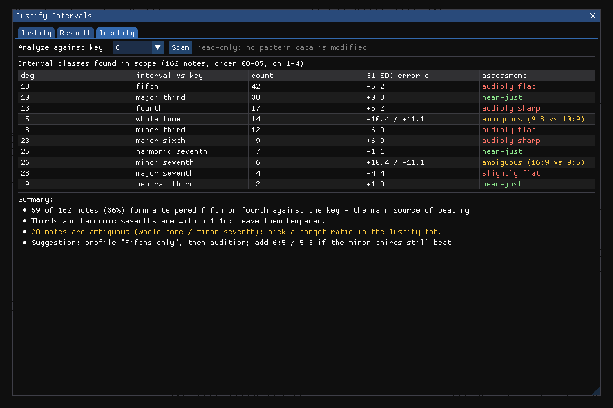

# Justify Intervals — feature plan

Status: planning (2026-08-19). No implementation yet. This document is the design
basis for a new GUI tool in the Furnace 31-EDO fork.

The dialog mockups embedded below are real Dear ImGui renders, produced by the
headless harness in `planning/imgui-mock/` (the repo's vendored ImGui compiled
against a small CPU rasterizer — no window, no GL, no app process). Rebuild them
with `planning/imgui-mock/build.sh run`; scene sources are in
`planning/imgui-mock/mock_main.cpp`.

## Problem

31-EDO renders thirds and septimal intervals nearly justly, but its fifth is the
meantone fifth: 18 steps = 696.77 cents against 3:2 = 701.955, about 5.2 cents
flat. Fourths mirror this (+5.2c), and minor thirds / major sixths are off by
about 6c. In sustained, exposed, or drone-based textures this reads as a subtle
"offness" (observed concretely in the fork's startup intro tune). The fix is
selective retuning: nudge notes by a few cents so that the intervals that matter
in a passage become just, using the pattern-effect machinery the engine already
has.

## Interval error budget (31-EDO vs. just)

One 31-EDO step = 1200/31 = 38.7097 cents. One `E5xx` unit = 1/128 step
= 0.3024 cents.

| steps | conventional name    | 31-EDO ¢ | just target | just ¢  | error   |
|------:|----------------------|---------:|-------------|--------:|--------:|
| 5     | whole tone           |   193.55 | 9:8 / 10:9  | 203.9 / 182.4 | −10.4 / +11.1 |
| 8     | minor third          |   309.68 | 6:5         |  315.64 | −5.96 |
| 10    | major third          |   387.10 | 5:4         |  386.31 | +0.78 |
| 13    | fourth               |   503.23 | 4:3         |  498.04 | +5.18 |
| 18    | fifth                |   696.77 | 3:2         |  701.96 | −5.19 |
| 21    | minor sixth          |   812.90 | 8:5         |  813.69 | −0.78 |
| 23    | major sixth          |   890.32 | 5:3         |  884.36 | +5.96 |
| 25    | harmonic seventh     |   967.74 | 7:4         |  968.83 | −1.08 |
| 26    | minor seventh        |  1006.45 | 16:9 / 9:5  | 996.1 / 1017.6 | +10.4 / −11.1 |
| 28    | major seventh        |  1083.87 | 15:8        | 1088.27 | −4.40 |
| 6     | septimal whole tone  |   232.26 | 8:7         |  231.17 | +1.08 |
| 7     | septimal minor third |   270.97 | 7:6         |  266.87 | +4.10 |
| 9     | neutral third        |   348.39 | 11:9        |  347.41 | +0.98 |
| 15    | septimal tritone     |   580.65 | 7:5         |  582.51 | −1.87 |

Takeaways:

- The audible offenders are the 3-limit intervals (fifth, fourth) and the
  6:5 / 5:3 pair. Thirds (5:4, 8:5) and septimal intervals need almost nothing.
- All corrections are single-digit cents except the deliberately ambiguous
  intervals (whole tone, minor seventh), where the user must *choose* a ratio.
- Every correction fits comfortably inside `E5xx`'s ±38.7c range, at ~0.3c
  resolution (a 5.2c fifth correction is 17 effect units).

### The comma problem (why "justify everything" is not one button)

31-EDO tempers out the syntonic comma (81:80); just intonation does not. Fixing
all notes to one 5-limit lattice rooted on the tonic produces wolf intervals
between non-tonic pairs: in a justified C major, D (9:8) against A (5:3) is
40:27 — 21.5c flatter than a just fifth, far worse than the tempered one. So the
tool cannot be "make it all just"; it must let the user pick *which* relations
are purified, per passage. This drives the mode split below.

## Feature shape

A dockable window (Furnace-style, like Find/Replace — not a blocking popup),
tentatively **window > justify intervals**, with three tabs sharing one scope
model.

### Shared scope model (copied from Find/Replace)

- Range: Song / Selection / Pattern (radio), plus channel From/To combos.
- Effect-column policy for writes: use a free effect slot; optionally widen
  `effectCols` when full; or skip the note and report it.
- All writes go through the scattered-cell undo idiom (`UndoStep` +
  per-cell diff, like `doReplace`), one undo step per Apply.

### Tab 1 — Justify (retune via E5xx)

The core. Pipeline: **scan → propose → preview → apply**.

*Setup view: key/root combo (31 spellings), profile preset, the interval-targets
table (per degree: tempered cents, target ratio, just cents, correction, and the
exact `E5xx` byte), the shared scope block, and the pitch-reset options. The
yellow banner shows the linear-pitch warning state. Ambiguous degrees (whole
tone, minor seventh) expose their ratio choice as an inline combo.*

1. **Key/root**: combo over the 31 spellings (same widget as song info's
   "Reference note") + octave-insensitive matching. The root's own pitch stays
   at its tempered 31-EDO value (anchor; prevents global drift).
2. **Tuning profile**: a preset combo plus an editable 31-row table
   (step-class relative to root → target: ratio or cents offset). Presets:
   - *5-limit* (just fifths, fourths, thirds, sixths against root)
   - *3-limit / Pythagorean* (pure fifths and fourths only; thirds untouched)
   - *7-limit* (adds 7:4, 7:6, 8:7 refinements)
   - *Fifths only* (the minimal "fix the offness" preset — likely the default)
   - *Custom* (user edits the table; ambiguous degrees like the whole tone
     expose a 9:8-vs-10:9 choice here)
   Only step-classes with a target set are touched; everything else is left
   tempered and can optionally get a pitch reset (below).
3. **Preview**: a results table (like Find's results list): location
   (order/row/channel), note name, step-class vs. root, current error,
   proposed `E5xx` value, and a checkbox per row to exclude. A summary line
   totals affected notes and skipped notes (with reasons: no free effect
   column, existing conflicting `E5xx`, sentinel notes).
4. **Apply**: writes `E5xx` on each accepted note row.

*Preview view: one row per note in scope with its degree, interval class,
correction, the exact effect write, and a status column (retune / anchor reset /
no-target reset / skip with reason). The checkbox column excludes individual
rows before Apply; the summary and warning lines total the outcome.*

Channel-persistence handling (the `E5xx` structural constraint):

- Option **"reset pitch on untouched notes"** (default on): any note in scope
  whose step-class has no target gets `E5 80` so a preceding correction does
  not bleed into it.
- Existing `E5xx` in scope: policy combo — *overwrite* / *compound* (add the
  correction to the existing offset) / *skip and report*.
- Warn banner when `linearPitch` is off (corrections are only cents-accurate
  in linear pitch mode).

### Tab 2 — Respell (find & replace notes, key-aware)

Substitution rather than retuning: move notes to a different 31-EDO slot. This
is the "find and replace certain notes in relation to a key" half of the idea.
Uses cases:

- Fix spelling mistakes: the passage says C# where Db was meant (one diesis
  apart, 38.7c — very audible).
- Deliberate harmonic respelling: e.g., replace the diatonic minor seventh
  (26 steps) with the harmonic seventh (25 steps) over a dominant-function
  root; replace a whole tone with a septimal one.

UI: a small rule list, each rule = "degree/spelling X (relative to key, or
absolute) → spelling Y", with the same scope + preview + apply flow. Presets:
"dominant 7th → harmonic 7th", "±1 diesis" nudges.

*Respell tab: ordered rule list (first match wins), per-rule enable, key-relative
or absolute matching, and the effect of each substitution stated in cents.
Substitution moves the note slot; it never writes `E5xx`.*

### Tab 3 — Identify (report only)

Analysis with zero writes: scan the scope and tabulate which interval classes
occur against the chosen root (and optionally between simultaneous notes),
with occurrence counts and cents errors. Serves two purposes: it tells the
user *whether* justification would matter before they commit, and it doubles
as the seed of the future counterpoint-assistant feature (shared analysis
core).

*Identify tab: read-only census of interval classes against the chosen key,
with counts, tempered error, a per-class verdict (near-just / audibly off /
ambiguous), and a plain-language summary that recommends a profile.*

## Deferred (phase 2+)

- **Chord-aware / adaptive justification**: per-row root detection (lowest
  sounding note or a user-tagged anchor channel), vertical-interval
  justification per sonority, Hermode-style. Solves the comma problem properly
  but needs cross-channel row scanning and drift policy. Fixed-root mode plus
  per-passage root choice (apply per selection) covers most practical cases
  first.
- Applying corrections via instrument-level detune instead of `E5xx` (for
  chips or workflows where the effect column is contended).
- Terpstra-window visualization of the chosen key/profile.

## Engine/GUI integration map

(from codebase survey, 2026-08-19)

- Note domain: slots 0..464, middle C 279, A-4 302; sentinels ≥507 skipped
  exactly as `doTranspose` does (`src/gui/editing.cpp:546`).
- `src/engine/edo31.h`: home for new helpers — proposed
  `edo31JustOffsetCents(stepClass, profile)` and a fractional-slot currency
  (integer part → note column, frac × 128 → `E5xx`), mirroring `tuner.cpp`'s
  cents math.
- Scope resolution + scattered undo: copy `doFind`/`doReplace` in
  `src/gui/findReplace.cpp` (range logic lines 75–107, undo idiom 216–468,
  effect-position negotiation 331–381).
- Window registration: the ~10 touchpoints traced for `findOpen`
  (`gui.h`, `doAction.cpp`, `gui.cpp`, `settings/allSettings.cpp`,
  `editControls.cpp`).
- Key-picker widget precedent: `src/gui/songInfo.cpp:94-141`.

## Open questions

1. Default preset: *Fifths only* vs. *5-limit*? (Fifths-only is the least
   surprising and directly targets the known offness.)
2. Should "reset pitch on untouched notes" also emit `E5 80` on the first
   note *after* the scope ends on each channel? (Leaning yes — otherwise the
   last correction bleeds past the selection.)
3. Respell tab: rules relative to key degree, absolute spelling, or both?
4. Does "Identify" belong as a tab here or as part of the future counterpoint
   assistant window?
